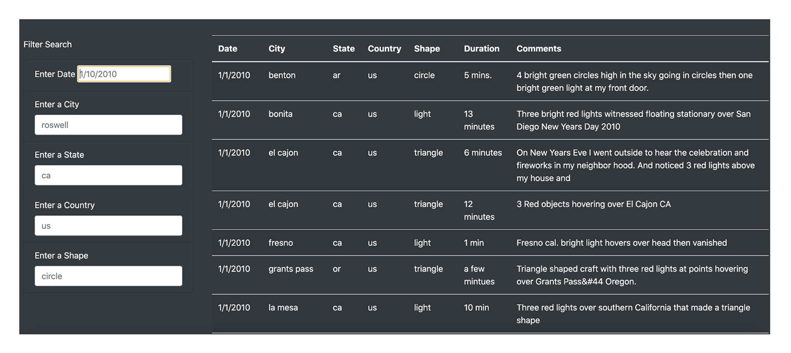

<p align="center">
  <a href="https://jovanipink.github.io/ufos/">
    
  </a>
</p>
<h1 align="center">
  UFOs
</h1>

> Providing more in-depth analysis of UFO sightings by allowing users to filter for multiple criteria at the same time. In addition to the date, you’ll add table filters for the city, state, country, and shape.

## What's included

- Single HTML page (`index.html`) that includes Bootstrap and D3 and bundled with Parcel.
- Includes Bootstrap (currently using v4.5.0) source files via npm.
- npm scripts (see `package.json`) for compiling and autoprefixing Sass; serving index.html with Parcel; and bundling with Parcel to a 'docs' folder to host on github pages.
- Example stylesheet (`static/scss/style.scss`).
- Example app JavaScript file (`static/js/app.js`) showing how to import all of Bootstrap and adding app logic with D3.

## Developer Usage

Be sure to have [Node.js](https://nodejs.org/) installed before proceeding.

```shell
# Clone the repo
cd ufos

# Install dependencies
npm i

# Start local server (uses Parcel)
npm run dev
```

Open <http://localhost:1234> to see the page in action.

## Overview of Project

UFOs is all about using D3.js and the [data](https://github.com/JovaniPink/ufos/blob/master/static/js/data.js) provided to all users dynamically search the data through a website [UFOs](https://jovanipink.github.io/ufos/). Users are able to get a more in-depth analysis of UFO sightings by allowing them to filter for multiple criteria at the same time and view the number of data points.

## Summary

The dataset provided is about UFO sightings in the United States with the following columns:

- Date
- City
- State
- Country
- Shape
- Comment

Our app is taking those columns and creating a HTML table using D3.js. We've also used Bootstrap to properly lay out the table and add a from where users could search by using the input tags:

- Date
- City
- State
- Country
- Shape

Based on the search criteria, the app would filter the table and generate a new one.

### User Usage

The website is currently hosted through the repo's Github and you could choose an input or multiple from the form above the table. Once you've entered all the filter, just click on the "Filter Table" button. A new table will be created for UFO sightings for the given filter list. We've made a little section on the top right of the table to let you know the amount of data points with the filters in place.

## Analysis and Challenges

We delivered the product to our client with the original mock looking like:



But we decided to make some design changes with the HTML and Bootstrap layout and styling, to look like this:


The Design is not the only issues and things we have planned to redo and iterate on. As you can see our forms do not validate the inputs and could break our app code. Also the state management in the app.js itself needs to be worked on so we don't have functions changing state outside of themselves and refactor to easily add better features.

## Todo Checklist

A helpful checklist to gauge how your README is coming on what I would like to finish:

- [ ] Experiment with GitHub Actions.
- [ ] [Learn more about GitHub Actions](https://github.com/features/actions)
- [ ] [read the Actions docs](https://help.github.com/en/actions)
- [ ] [browse the Actions Marketplace](https://github.com/marketplace/actions)
- [ ] [Using GitHub Actions for MLOps & Data Science](https://github.blog/2020-06-17-using-github-actions-for-mlops-data-science/)

## Contributing

Pull requests are welcome. For major changes, please open an issue first to discuss what you would like to change.

Please make sure to update tests as appropriate.

## License

[MIT](https://choosealicense.com/licenses/mit/)
